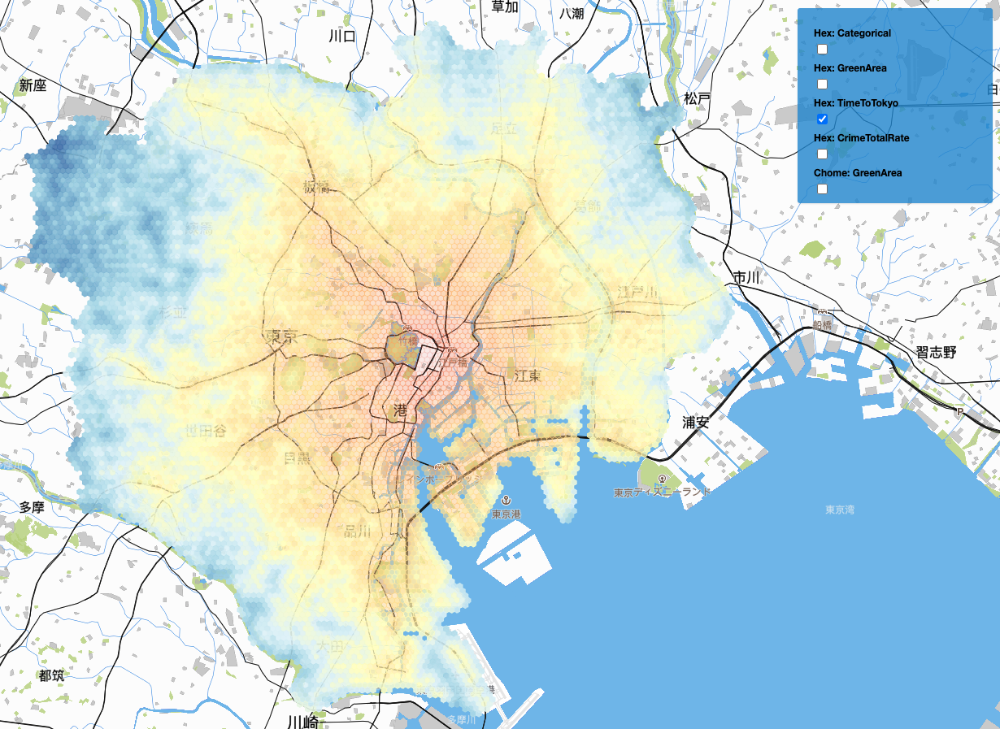

# Best Basho Visualizer v0.02

@author: [Shuto Araki](https://github.com/ShutoAraki)


This tool semi-automates the geospatial data exploration process using Mapbox and deck.gl.

You can pick the data you would like to visualize and this tool immediately fetches the right data and adjust layer schemes to render it in front of you!

## Getting Started

### 0. Install Node.js and set up your Mapbox Token
This application uses the Node.js environment. The latest version is recommended. The versions 14.3.0 and 14.5.0 are tested to work. (NPM is 6.14.5 at the time of development.)

You also need a [Mapbox token](https://docs.mapbox.com/help/glossary/access-token/) in order to render a map.
Set `MapboxAccessToken` environment variable on your computer.

On Mac/Linux, that means running `export MapxboxAccessToken=whatever_token_you_have`.
On Windows, you can run `set MapboxAccessToken=whatever_token_you_have`.

### 1. Install dependencies
```
npm install
yarn add @loaders.gl/core
yarn add @loaders.gl/wkt
```

### 2. Set up the data folder server
Install `http-server` by following the instructions [here](https://www.npmjs.com/package/http-server). (It is most likely just this command: `npm install --global http-server`.)

Once you install the package, run the following command. Substitute `[YOUR_DATA_FOLDER]` with the path to your data folder.
```
http-server --cors -p 8081 [YOUR_DATA_FOLDER]
```
This command opens the port 8081 and allow other processes to access the csv files.

#### Data format requirements

- The folder needs to contain `[data_type]Data-Core.csv` where geometry files are stored in [`wkt`](https://en.wikipedia.org/wiki/Well-known_text_representation_of_geometry) format. (e.g., `hexData-Core.csv` for the `hex` data type.) These will be loaded at the beginning and additional columns will be appended on demand. The data should also contain `in23Wards` and `inTokyoMain` columns whose values are all boolean, indicating whether a given row is in Tokyo 23 wards or not, etc. This setting is modifiable in `main.py`.

- The folder also needs to have the master data files named `[data_type]Data-Master_v003.csv`. Whatever column names that you would like to include need to be inside this dataset.

### 3. Start the application
In `main.py`, specify the columns and area that you would like to explore. The `varList` is a list of names that specify data types and column names separated by `_`. (e.g., `Hex_NumJobs` for `numJobs` column in `hex` data. Case insensitive for a data type and the first character of a column name.) The `mappingArea` variable can be either `'inTokyoMain'` or `'in23Wards'` or `None`. It is by default `None` and shows the entire area in the original data without filtering.
```
python main.py
```
It should now be running at [`http://localhost:8080/`](http://localhost:8080/).

### 4. Customize layers and data
The `src/data` folder contains all the customizeable JSON configurations in this system.

#### Edit layer configurations
Edit the `src/data/layerConfig.json` file to customize layer colors, scales, and interpolation for a specific layer. The keys are layer names and values are the configuration objects.

Layer names are formatted as `[data_type]_[column_name]` (Same as how you specify columns in `main.py`) **Currently, only numerical data are supported.** Categorical data are rendered with randomly generated colors.

A layer "Hex_NumJobs" can be formatted as follows:

```js
"Hex_NumJobs": {
    "colors": ["#ffffe510", "#f7fcb920", "#d9f0a350", "#addd8e", "#78c679"],
    "scale": [0, 0.25, 0.5, 0.9, 1.0],
    "scaleBy": "percentage",
    "reverse": false,
    "type": "normalized",
    "interpolate": true
}
```

#### Parameters

- `colors` **[Array][41]** **\*required**
Each color is represented by its hex code. Opacity for each color can be set by appending two digit number at the end of a hex number. By default, the opacity is set as 100%. (e.g., `#f0241605` is red with 5% opacity.)

You can also specify a color by words. (e.g., `"colors": ["lightBlue", "blue", "red"]`) You can edit `src/data/COLORS.json` to add more reserved keywords.

If it is too much work to specify each color, you can even name your favorite color scheme in `src/data/COLOR_SCHEMES.json`. (e.g., `"colors": "white2red"`)

- `scale` **[Array][41]**
If provided, the array has to be the same length as the `colors` array so that each value in this array corresponds to each color in the same position.
If not provided, colors are equally spaced out.

- `type` **[string][42]** **\*required**
    - `'normalized'` if the data should be normalized with mean and standard deviation. $t = \frac{x - \mu}{\sigma} \forall x \in D$. 
    The calculated values are clipped in the range of $[-5, 5] \in \mathbb{R}$. These values will be mapped to $[0, 1] \in \mathbb{R}$.
    - `'standardized'` if the data should be standardized with minimum and maximum. $t = \frac{x - min}{max - min} \forall x \in D$. The calculated values will be mapped to $[0, 1] \in \mathbb{R}$.
    The mapping function is defined by the `interpolate` parameter.

- `scaleBy` **[string][42]** **\*required only if scaled by raw values**
    - `'value'` if the provided scaling is by raw numbers where mininumn and maximum of the data map to 0.0 and 1.0 respectively. (So the first and last values in the `scale` array are replaced with minimum and maximum values automatically)
    - `'percentage'` if the provided scaling is by percentage where 0.5 directly corresponds to the mapped value of $t$. (But it does not check if it is actually named 'percentage')

- `reverse` **[boolean][43]** **\*required** - reverses the color scheme if set to `true`

- `interpolate` **[boolean][43]** **\*required** - linearly interpolates across the colors if set to `true`

## Examples

The following setting results in the map below.

### Configuration
```js
// layerConfig.json

{
    "layers": {
        "default": {
            "colors": "default_blue2red",
            "reverse": false,
            "type": "standardized",
            "interpolate": true
        },
        "Hex_GreenArea": {
            "colors": ["#ffffe5", "#f7fcb9", "#d9f0a3", "#addd8e", "#78c679"],
            "scale": [0, 0.25, 0.5, 0.9, 1.0],
            "scaleBy": "percentage",
            "reverse": false,
            "type": "standardized",
            "interpolate": false
        },
        "Chome_GreenArea": {
            "colors": "white2green",
            "reverse": true,
            "type": "normalized",
            "interpolate": true
        },
        "Hex_CrimeTotalRate": {
            "colors": ["#d73027", "#f46d43", "#fdae61", "#fee090", "#ffffbf", "#e0f3f8", "#abd9e9", "#74add1", "#4575b4"],
            "scale": [0, 0.0001, 0.0005, 0.001, 0.003, 0.004, 0.005, 0.006, 0.008],
            "scaleBy": "value",
            "reverse": true,
            "type": "normalized",
            "interpolate": true
        }
    }
};
```

### Results





[40]: https://developer.mozilla.org/docs/Web/JavaScript/Reference/Global_Objects/Object
[41]: https://developer.mozilla.org/docs/Web/JavaScript/Reference/Global_Objects/Array
[42]: https://developer.mozilla.org/docs/Web/JavaScript/Reference/Global_Objects/String
[43]: https://developer.mozilla.org/docs/Web/JavaScript/Reference/Global_Objects/Boolean
[44]: https://developer.mozilla.org/docs/Web/JavaScript/Reference/Global_Objects/Number
[45]: https://developer.mozilla.org/docs/Web/JavaScript/Reference/Statements/function